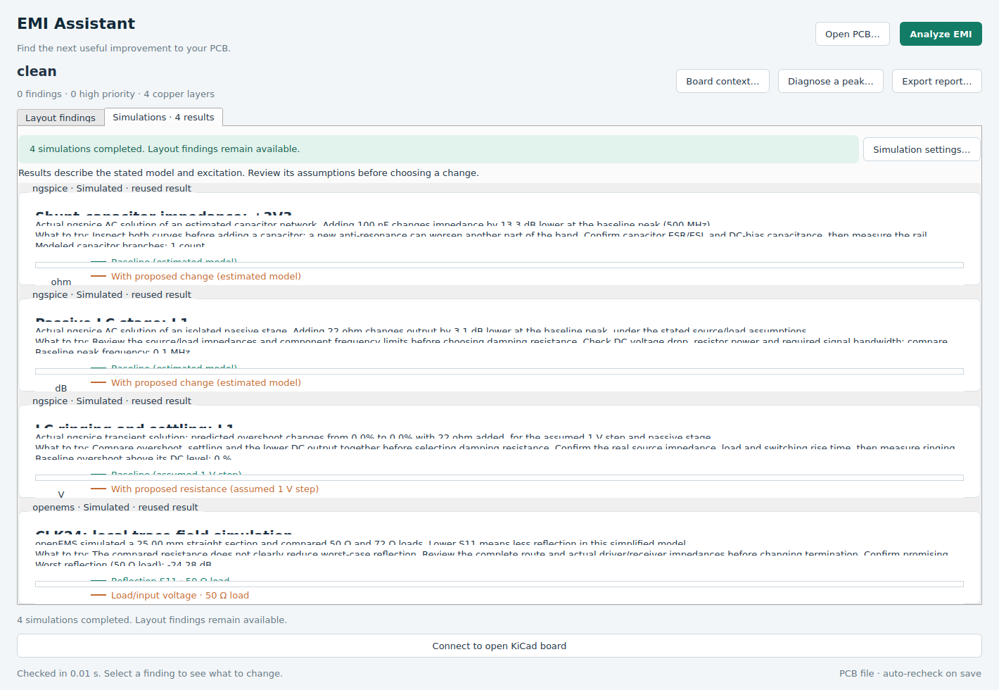

# EMI Assistant for KiCad

**Open a PCB. Click Analyze EMI. See what to investigate next.**

EMI Assistant brings layout screening, circuit comparisons with **ngspice**, and
local trace simulations with **openEMS** into one workflow launched from KiCad.
It opens a native companion window with prioritized findings, explanations,
board navigation, and comparison graphs.

**[Download EMI Assistant 0.2.1](downloads/EMI-Assistant-0.2.1.zip?raw=true)** ·
[User guide](docs/USER-GUIDE.md) · [Simulation details](docs/SIMULATION.md)

Original application code: **MIT**. Copied KiCad schemas and runtime libraries
retain their licenses; see [third-party notices](THIRD_PARTY_NOTICES.md).

## Install and run

1. Download the ZIP above. In **KiCad 10 → Plugin and Content Manager**, choose
   **Install from File** and select it. Apply the installation.
2. In **Preferences → Plugins**, enable **KiCad API** and check that a Python
   interpreter is detected.
3. Restart the PCB Editor, open your board, and click **Analyze EMI**.

The first click may open a preparation window to install the application's
Python dependencies. On **Windows x64**, missing supported solvers are downloaded
automatically from verified official releases. Layout findings appear first;
simulations run in the background. Later runs reuse installed engines and
unchanged results.

No account or PCB upload is required. Analysis runs locally and works offline
after setup. Linux and macOS require installed solver executables; automatic
portable solver downloads currently support Windows x64.

If the button is missing, check **Preferences → PCB Editor → Plugins → Show
Button**. See [installation troubleshooting](docs/INSTALLER-FIX.md).

## What it helps you do

| Task | What you get |
|---|---|
| Find layout risks | Checks for reference-plane gaps, return connections at layer changes, decoupling paths, marked buck/boost layouts, and sensitive or cable-net proximity |
| Understand a finding | Location, evidence, confidence, plain-language guidance, and **Show in KiCad** navigation |
| Compare circuit changes | ngspice capacitor-network impedance, supported RC/LC filter response, and LC ringing before and after a candidate change |
| Investigate a trace | openEMS reflection and voltage-transfer comparisons for a supported local microstrip section with two termination choices |
| Diagnose a measured peak | Clock-harmonic hypotheses, CSV spectrum import, measurement notes, and suggested experiments |
| Share a review | HTML or JSON reports containing findings, numerical comparisons, assumptions, and coverage |

Both enabled solvers start with **Analyze EMI**. You can cancel simulation while
continuing to review layout findings. Optional board context and simulation
settings are remembered with the board.

Want to explore first? Use **Try the example board** for layout findings, or open
[examples/clean.kicad_pcb](examples/clean.kicad_pcb) for a fixture that supports
both solvers. The [example report](docs/example-simulation-report.html) contains
an actual completed solver run.

## Scope and current status

**This is an early release for engineering investigation.** Layout checks are
screening rules. ngspice runs bounded passive models; openEMS runs a local
straight-trace coupon derived from PCB geometry and stackup. Neither is a
whole-board emissions prediction or a compliance result. Unsupported geometry
and missing inputs are reported explicitly.

Saved schematics and custom-symbol pins can enrich the analysis. This release
does not execute arbitrary custom-IC or vendor SPICE models. See
[supported models and assumptions](docs/SIMULATION.md).

The 0.2.0 release passed **286 tests and 32 subtests**, with real Linux ngspice
and openEMS runs documented separately. Native Windows/KiCad GUI execution and
hardware EMC validation remain pending. See the full [validation record and
acceptance checklist](docs/VALIDATION.md).

## Develop or contribute

See [CONTRIBUTING.md](CONTRIBUTING.md) for setup, tests, and package building.
Bug reports with the KiCad version, operating system, and a small reproducible
example are especially useful. Check your board and logs before sharing them.

[Changelog](CHANGELOG.md) · [Application MIT license](LICENSE) · [Third-party licenses](THIRD_PARTY_NOTICES.md)
